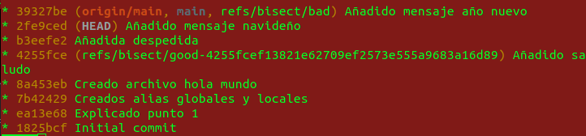
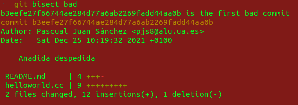

# practicaDCA
Proyecto para la práctica 10 de DCA

## Pasos para dar de alta el proyecto y configurar git

- Creamos proyecto en githab. Creando el repositorio nos dará un enlace, lo utilizaremos.
- En local, en una carpeta, ejecutamos:
``` git
git init
```
- Eso nos creará un repositorio, ahora toca asociarlo al remoto:
``` git
git remote add origin git@github.com:realpascuu/practicaDCA.git 
```
- Solo quedaría asociar la rama al repositorio (creando la rama main se asocia automáticamente):
``` git
git checkout -b main
```
- Por último, nos bajamos la versión actual del repositorio:
``` git
git pull
```
> En mi caso ya tenía configurado el nombre de usuario y el email, pero se haría con los siguientes comandos:
> ``` git
> git config --global user.name "nombre"
> git config --global user.email "usuario@email.com"
> ```

## Crear alias locales y globales
### Globales
``` git
git config --global alias.showGraph 'log --all --graph --oneline'
git config --global alias.crearRama 'checkout -b'
git config --global alias.st status
```

### Locales
En **~/.zshrc**:
``` git
#alias de git           
alias ga='git add '   
alias gc='git commit ' 
```

## Creado programa sencillo

- El programa manda un saludo al nombre que introduzca el usuario por la pantalla
- Ahora creamos un error
- Nos damos cuenta de que hay un *bug*: hay error ahora y no había error cuando solo estaba implementado el saludo.
``` git
    git bisect start
    git bisect bad (el commit actual sabemos que está mal)
    git bisect good 4255fce (Commit de añadido saludo)
```

- Nos quedaría algo así:

- Ahora vamos marcando cada commit como good o bad dentro de ese rango.
- Acabamos encontrando el primer commit con fallo:

- Solo quedaría ir al commit del fallo, crear una rama de error, corregirlo y mergear a la rama principal. El resultado sería el siguiente:
